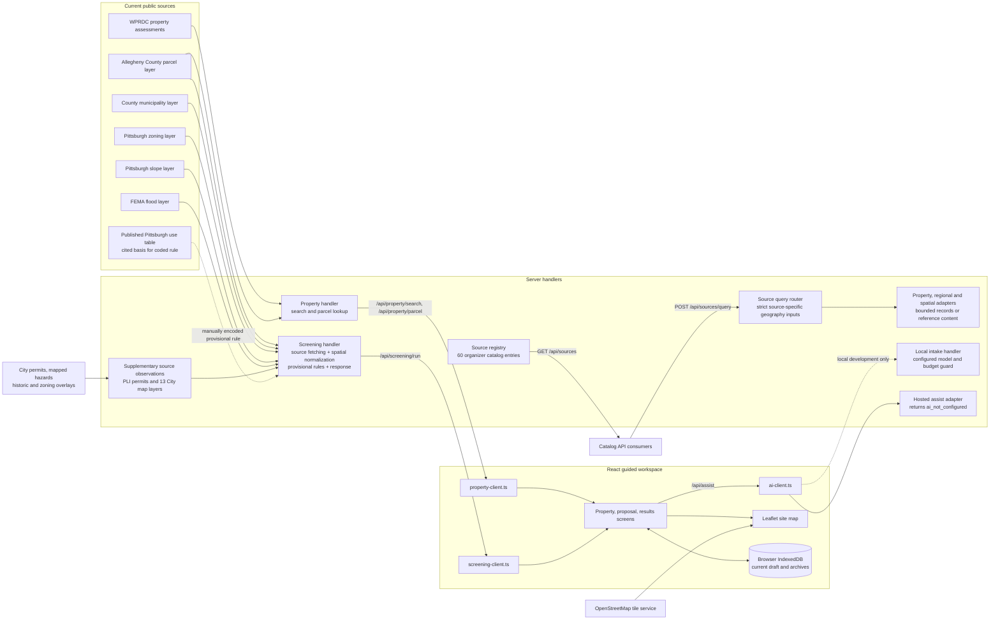
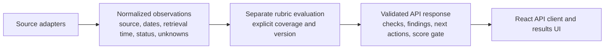

# Application architecture

This describes the current walkthrough implementation. It separates observed code paths from a proposed service seam; it does not describe the future explorer as shipped architecture.

See [source coverage](source-coverage.md) for the supplied zoning map's additional layers and the unresolved difference between its zoning endpoint and the application's endpoint.

## Current request and data flow

Local development serves the React app with Vite and the API handlers from `server/dev.mjs`. Vercel API wrappers call the same property and screening handlers. Hosted AI is explicitly disabled. The local intake handler is configured for DeepSeek through OpenRouter with request limits and budget checks; it is separate from property checks and is not invoked by screening.

Project drafts and archives live in browser IndexedDB. Supabase Auth and cloud project storage are not connected. The map loads OpenStreetMap tiles directly in the browser. Its basemap is visual context, separate from parcel geometry and screening evidence; the County boundary comes through the property API and is independently fetched by screening.

## Source coverage and limits

| Use | Source | Current behavior |
| --- | --- | --- |
| Address/parcel lookup and assessment observation | [WPRDC property assessments](https://data.wprdc.org/dataset/property-assessments), queried through `https://data.wprdc.org/api/3/action/datastore_search` | Exact parcel ID or house number and street filters. Returned assessment fields are normalized in `server/property/live.mjs`. |
| Parcel boundary | [Allegheny County Web Parcels](https://gisdata.alleghenycounty.us/arcgis/rest/services/EGIS/Web_Parcels/MapServer/0) | Exact `PIN` match and validated polygon geometry. Parcel IDs remain strings. |
| Municipality | [Allegheny County Municipal Boundaries](https://services1.arcgis.com/vdNDkVykv9vEWFX4/arcgis/rest/services/AlleghenyCountyMunicipalBoundaries/FeatureServer/0) | Within and intersects results must agree on the full parcel. |
| Pittsburgh zoning | [Pittsburgh zoning layer](https://pghbridgis.pittsburghpa.gov/federated/rest/services/Zoning/MapServer/0) | Whole-parcel within/intersects agreement is required. |
| Mapped steep slope | [Pittsburgh 25 percent slope layer](https://services1.arcgis.com/YZCmUqbcsUpOKfj7/arcgis/rest/services/PGHWebSlope25/FeatureServer/0) | Intersecting features are interpreted as mapped flags, not actual grade. |
| Mapped flood zone | [FEMA National Flood Hazard Layer](https://hazards.fema.gov/arcgis/rest/services/public/NFHL/MapServer/28) | Intersects and within observations feed a bounded map screen, not a flood determination. |
| Provisional zoning use screen | [Pittsburgh use table](https://ecode360.com/45476538) | Narrow check for one detached home in an R1D district. It does not establish permission. |
| Map basemap | [OpenStreetMap tiles](https://tile.openstreetmap.org/{z}/{x}/{y}.png) | Browser tiles and attribution only, not evidence used by screening. |

`server/screening/run.mjs` currently combines core source requests, geometry normalization, rule evaluation, action generation, score gating and response shaping in one handler. Supplementary acquisition is separated into `server/screening/observations.mjs`, returning `sourceObservations` for exact-parcel PLI permits and 13 City map layers. These observations retain their own status and provenance; a mapped overlap is not a completed regulatory assessment. They do not complete the fixed seven-factor rubric.

Screening only fetches City checks and FEMA data after exact parcel and Pittsburgh municipality checks succeed. Non-Pittsburgh parcels return pending first. The R1D rule remains provisional and narrow. Broader zoning requirements, process, infrastructure and financial feasibility remain unassessed. The complete-coverage gate withholds all score values and ranges whenever any required factor is not assessed; current coverage therefore returns pending.

`GET /api/sources` exposes all 60 organizer catalog entries with per-source runtime status and coverage notes. Catalog discovery is distinct from record ingestion. The local inventory found organizer documents and catalog CSVs, not copies of the underlying 60 datasets. Regional statistics, financial sources and reference-only entries have not become parcel evidence merely by appearing in the registry.

`POST /api/sources/query` accepts a catalog ID and validated source-specific context. It routes to property, regional/financial or spatial/reference adapters and returns bounded records, actual geography and match method, provenance, retrieval time and a source vintage when established. Input requirements, unavailable access, incomplete reads and provider errors are explicit. Catalog-wide dispatch does not mean every provider is fully connected: bulk import gaps and access requirements remain visible. These query results do not feed the screening rubric automatically.

The separate `feat/property-explorer` and `feat/proposal-comparison` worktrees contain incomplete UI work. Neither new page is wired into this application or hosted, and neither is verified as a product flow. Candidate lookup today is a bounded WPRDC record query, not a citywide discovery index. A stable shared snapshot of parcel observations is also absent; property display and screening make separate source requests.

## Code boundaries

| Boundary | Files | Contract |
| --- | --- | --- |
| HTTP routes | `api/property/search.mjs`, `api/property/parcel.mjs`, `api/screening/run.mjs`; local equivalent in `server/dev.mjs` | Thin wrappers delegate to shared handlers. |
| Property data | `server/property/live.mjs` | Normalizes source records into parcel candidates and independent assessment/boundary observations, including status and provenance. |
| Assessment | `server/screening/run.mjs` | Accepts a parcel ID and structured proposal, fetches evidence and returns checks, next actions, rubric version and gated score. |
| Supplementary observations | `server/screening/observations.mjs` | Bounded requests for parcel-linked permits and mapped features, independently preserving errors and incomplete responses. |
| Catalog discovery | `server/sources/registry.mjs`, `api/sources.mjs` | `GET /api/sources` distinguishes connected adapters from catalog references. |
| Source retrieval | `server/sources/query.mjs`, `api/sources/query.mjs` | `POST /api/sources/query` validates source ID and geographic input, then bounds and validates the adapter response. |
| Provider adapters | `server/sources/wprdc.mjs`, `core.mjs`, `regional.mjs`, `spatial-reference.mjs`, `nces.mjs`, `zip-range.mjs` | Separate public records, aggregate/financial metrics, geographic observations and document references. |
| Browser contracts | `src/features/projects/property-client.ts`, `src/features/projects/screening-client.ts` | Same-origin requests; screening validates returned parcel, proposal and result shape. |
| Local persistence | `src/features/projects/draft-store.ts` | Device-local draft inputs and archives; walkthrough screening results are transient. |

## Proposed seam, not yet implemented

This separation is a future design direction. The current screening handler has not been split into these layers, and its observation objects are not a persisted or shared parcel snapshot.
