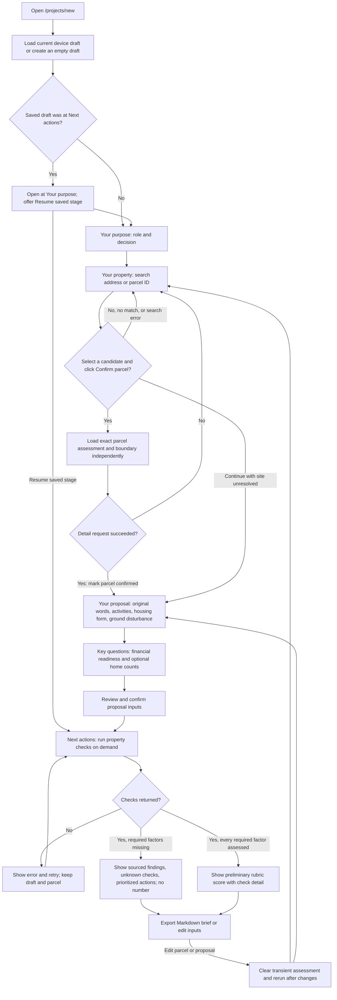
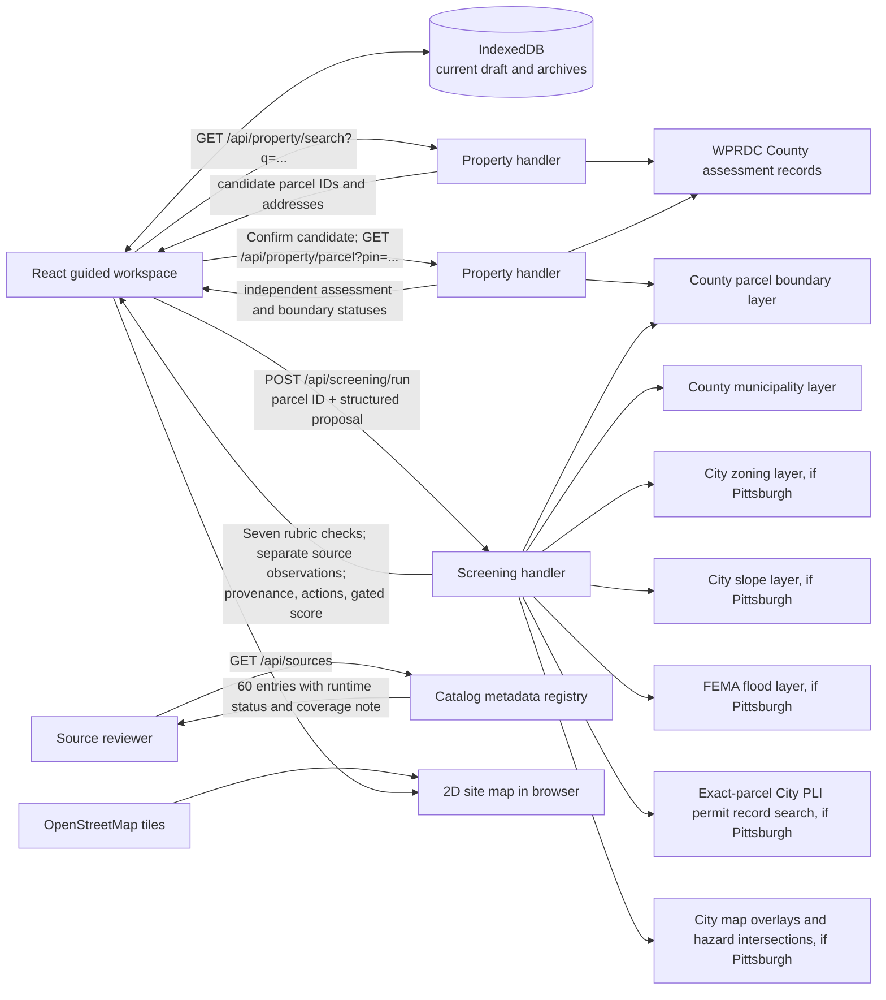
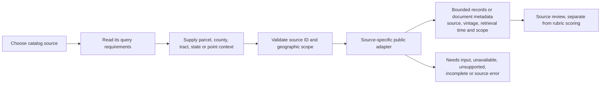

# Housing Navigator flow

This page traces the single-property walkthrough across the separately reviewed walkthrough and backend branches. It describes the current local code path; the deployed site may be at an earlier commit. See [application architecture](docs/architecture.md) for API boundaries and [source coverage](docs/source-coverage.md) for the limits of each public record check. The separate explorer and proposal-comparison worktrees are unfinished and are not part of this flow.

## Current user journey



The six screen names above are the current implementation, not accepted final screen design. The project lead has rejected the Review and Next actions presentation; functional corrections are reviewed separately from acceptance of that design. Property detail must load before the draft is marked confirmed. The user can continue with an unresolved site, but property checks stay unavailable until a live parcel is confirmed. The right-hand interactive 2D map remains part of the guided layout. Its OpenStreetMap tiles are visual context, while the County parcel boundary and public records are evidence with separate source details. A saved parcel ID can outlive its transient geometry, so the UI offers a fresh record load and exposes load errors.

The optional **Suggest from my words** action sends the original proposal text to `/api/assist`. Locally, the server uses the configured DeepSeek endpoint through OpenRouter with a budget guard. Suggestions are validated, shown for user selection, and never establish a parcel, permission or feasibility. On the hosted site, `/api/assist` returns `ai_not_configured`; hosted AI is disabled. Jev is not integrated. Manual structured entry and the public-record checks do not depend on an AI response.

## Current request and evidence flow



Candidate search is a bounded assessment-record query, not a countywide candidate-discovery index. The confirmed parcel ID stays a string. Property detail and screening request public sources separately; there is no shared persisted observation snapshot. A returned assessment field, a drawn boundary or a completed form field is not a feasibility finding.

The screening handler first fetches the exact County parcel boundary, then checks full-parcel municipality consistency. It queries Pittsburgh zoning, mapped slope, FEMA flood, exact-parcel PLI permit records and selected City map layers only after confirming Pittsburgh jurisdiction. The additional permit and map results are bounded `sourceObservations`, separate from the seven fixed rubric checks. A permit record or map intersection can identify something to review; it does not establish the proposal's review path, permission or a complete rubric factor. Source failures, missing records, boundary conflicts and unsupported checks remain explicit. The coded zoning use screen is provisional and narrow: one detached home in an R1D district. Other Allegheny County municipalities can enter the walkthrough, but their jurisdiction-specific checks remain incomplete.

`GET /api/sources` lists the organizer catalog's 60 metadata entries with runtime status and coverage notes. It is a source inventory, not a bulk import of 60 datasets or a new candidate-search interface. The current guided UI does not consume this catalog endpoint. Screening returns source observations as a separate API field; the current results panel centers on the seven rubric checks and their actions.

The backend also supports source-specific retrieval through `POST /api/sources/query`:



This API preserves the distinction between parcel observations, county or tract aggregates, national indexes and reference documents. An all-catalog query interface is not proof that all underlying providers are accessible or all bulk formats are ingested. The source registry and response explain the currently supported mode and remaining limits for each entry.

For example, a county employment request uses an explicit county identifier and year:

```json
{
  "catalogId": 29,
  "context": { "countyFips": "42003", "year": 2024 }
}
```

Send this JSON to `POST /api/sources/query` from the same origin. The response carries `catalogId`, `status`, `coverage`, `sourceUrl`, `sourceDate`, `retrievedAt`, bounded `records` and `summary`. Read the status and coverage even when HTTP succeeds. `available` describes source retrieval, while `needs_input`, `unsupported`, `unavailable`, `incomplete` and `error` describe distinct limitations. `empty` is a bounded source result, not proof that a condition or obligation is absent.

Every required rubric factor must have an assessed status before any Development Ease Score, range or per-check numeric contribution is returned. Current source coverage leaves required factors unknown or unsupported, including broader zoning, process and infrastructure; an absent mapped undermining feature also leaves site conditions unassessed. The current response is therefore `pending` with `score: null`, named checks and next actions. Financial feasibility also remains unassessed. The result includes source URLs, source dates when available, retrieval time and a rubric version; unknown dates stay unknown. Editing inputs or refreshing sources clears the transient result. Export includes provenance for a result when one is present.

## Current storage, failures and future boundaries

The browser saves the current draft and archived drafts in IndexedDB. Assessment results are transient and must be rerun after reload or edit. Storage failures are shown without implying the work was saved. Local Vite and the development server expose the same property and screening paths used by thin hosted API adapters. A source or API failure leaves user inputs available for retry. The public-record screen is deterministic; it does not ask the model to fill missing evidence.

Supabase Postgres, Supabase Auth, owner-scoped cloud history and cross-device projects are selected or proposed in the product record but are not connected here. A normalized, reusable parcel observation snapshot and a separate versioned rule evaluator are also proposed boundaries, not current services. The future property explorer would use user-confirmed AI search criteria, candidate parcels and a map-led view; the future comparison would hold one parcel fixed while comparing proposals. Neither is a live route in this walkthrough.

## Financial evidence boundary

An early financial screen needs separate vertical construction, site work and soft-cost assumptions alongside credible revenue or appraisal evidence. Builder scale, housing form, scope and timing affect those assumptions. Regional price indexes, permit valuations and aggregate rents retain their original meaning; none becomes a project estimate simply because the source query succeeds.

Site-condition unknowns can lead to targeted due diligence for utilities, soil, buried demolition material, contamination and undermining. An empty map response does not settle those questions. Expert anecdotes are not validated default cost ranges, and a possible variance is not an approval prediction. The application currently collects financial readiness and returns diligence tasks; it does not implement this full financial calculation or a financial verdict.
